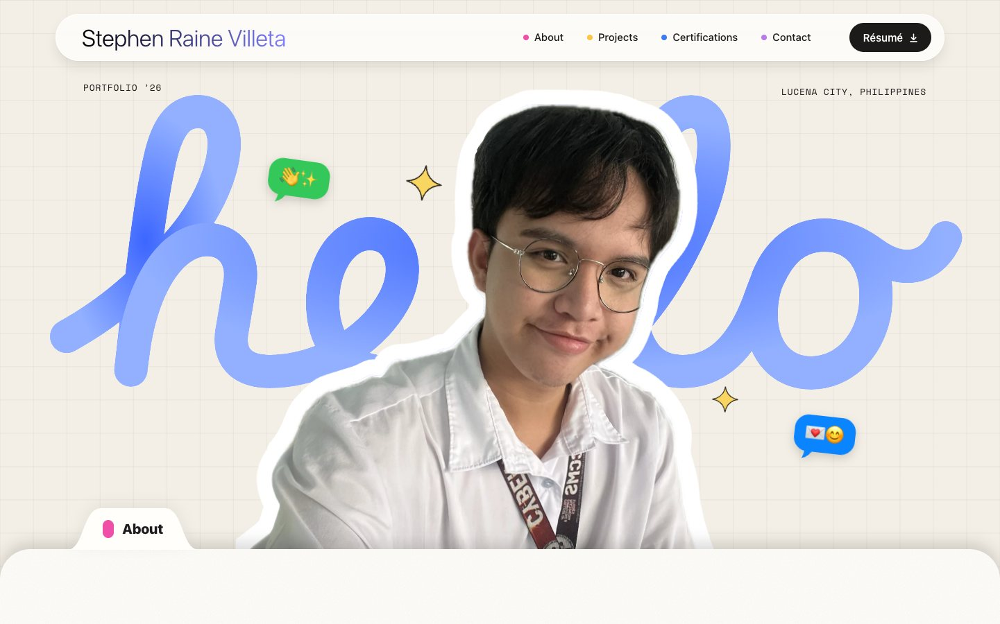
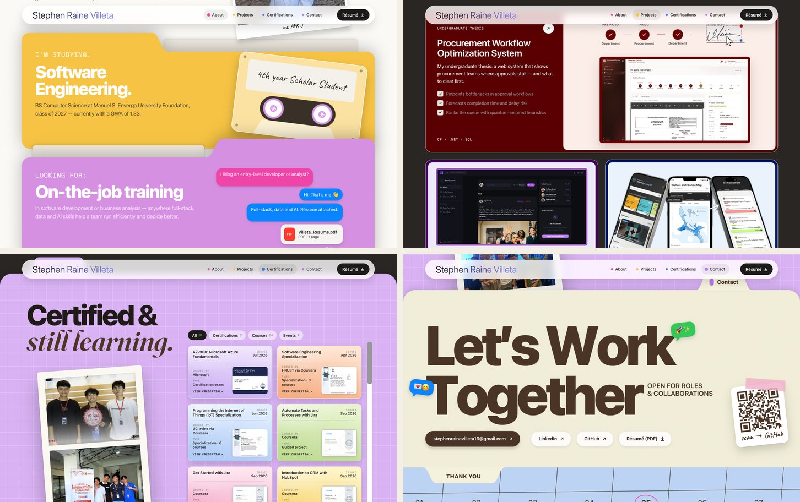
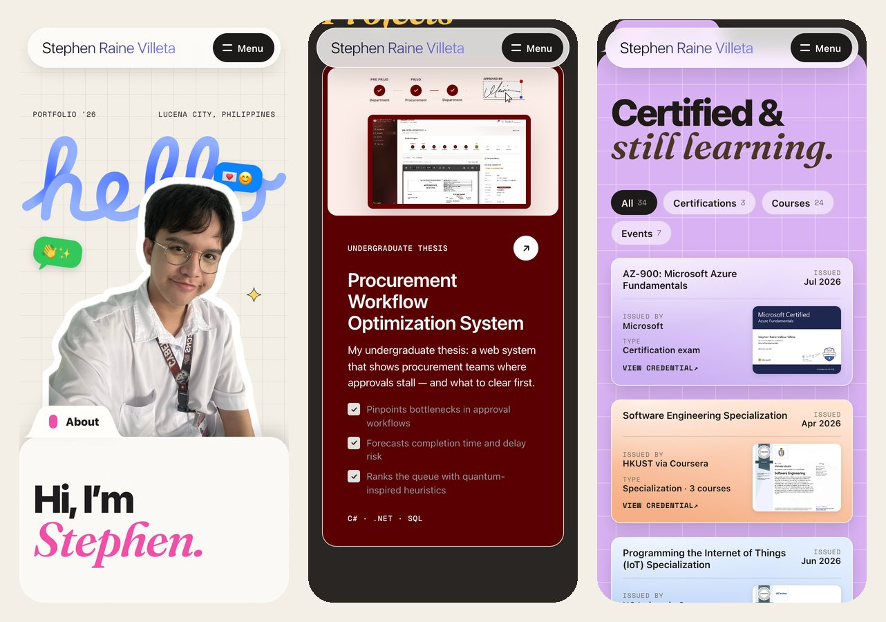

<div align="center">

# Stephen Raine Villeta

**Computer Science student · Software Engineering · Full-stack, data & AI**

Lucena City, Philippines

[**View the live portfolio →**](https://stephenrn.github.io/Portfolio/)

[Résumé (PDF)](StephenRaine_Villeta_Resume.pdf) · [LinkedIn](https://www.linkedin.com/in/stephenrn/) · [GitHub](https://github.com/stephenrn) · [Email](mailto:stephenrainevilleta16@gmail.com)

</div>

<br />



## About me

I’m a BS Computer Science student at Manuel S. Enverga University Foundation, majoring in Software Engineering (class of 2027, GWA 1.33). I work where software meets operations: full-stack apps, data and AI that help organizations run efficiently and make better decisions.

I’m looking for **on-the-job training** in software development or business analysis.

## Featured projects

| Project | Summary | Built with |
| --- | --- | --- |
| **Procurement Workflow Optimization System**<br><sub>Undergraduate thesis</sub> | Shows procurement teams where approvals stall, forecasts completion time and delay risk, and ranks the queue with quantum-inspired heuristics. [Request a demo](mailto:stephenrainevilleta16@gmail.com?subject=Demo%20request%20%E2%80%94%20Procurement%20Workflow%20Optimization%20System) | C#, .NET, SQL |
| [**CheckMatePH**](https://github.com/jpmartirez/checkmateph)<br><sub>Top 12 finalist, SIKAPTala 2026</sub> | AI-powered fact-checking for political claims and civic engagement. | Next.js, TypeScript, Supabase, OpenAI API |
| [**Unloque**](https://github.com/stephenrn/Unloque)<br><sub>Welfare access & analytics</sub> | Maps beneficiary distribution in real time and flags underserved areas to guide resource allocation. | Flutter, Firebase, Next.js |
| [**Liwanag**](https://github.com/p-ragudo/capstone_openit)<br><sub>Open iT Bootcamp 2026 · built in 17 hours</sub> | Tracks household energy use and estimates the electricity bill before it arrives. | React, ASP.NET Core, PostgreSQL, Docker |
| [**Yougyog**](https://github.com/Jedybox/OpenITCodeFest2025)<br><sub>Open iT CodeFest 2025 · built in 17 hours</sub> | Real-time earthquake alerts with safety steps, event summaries and quake history. | React, Express, Socket.IO, USGS API |

## Skills

| | |
| --- | --- |
| **Business & analytics** | Business process analysis, data analysis & reporting, forecasting, market research |
| **Languages** | Python, Java, C++, C#, Dart, JavaScript, TypeScript, SQL, Swift |
| **Frameworks & APIs** | React, Next.js, Node.js, Express.js, ASP.NET Core, Flutter, Tailwind CSS, OpenAI API |
| **Data, cloud & tools** | PostgreSQL, MySQL, Supabase, Firebase, Microsoft Azure, Docker, Git, GitHub |

## Certifications

- **AZ-900: Microsoft Azure Fundamentals** · Microsoft · Jul 2026
- **Software Engineering Specialization** · HKUST via Coursera · Apr 2026
- **Programming the Internet of Things Specialization** · UC Irvine via Coursera · Jun 2026
- **Software Testing, Deployment, and Maintenance Strategies** · IBM via Coursera · Jun 2026
- **Ethics of Artificial Intelligence** · Politecnico di Milano via Coursera · Sep 2025
- **Data Privacy and Protection Standards** · Coursera · Oct 2025

The [Certificates section](https://stephenrn.github.io/Portfolio/#certifications) lists all 34 credentials. Each one opens its certificate and a verify link where available.

**Hackathons & activities:** SIKAPTala 2026 (Top 12 finalist) · Open iT CodeFest 2025 · ASEAN Data Science Explorers 2026 · BPI DATA Wave 2025 · Tech Nexus 2024 · AppCon 2024

---

## About this site

Designed in Figma and hand-built with plain HTML, CSS and JavaScript. It has no framework, build step or dependencies.



**Interactions**

- The “hello” on the cover draws itself, and the cover layers follow the pointer
- Chat bubbles type themselves in, and the cassette reels spin
- Skill keys press in a wave (type a letter to press matching keys)
- Project cards tilt on hover and open screenshot galleries
- Certificates can be filtered and viewed in a lightbox with verify links
- The contact calendar shows the current week with today circled
- Everything respects `prefers-reduced-motion`

**Responsive**

The desktop layout is measured against the 1441px Figma frame and scales with the window. Below 1100px it reflows into a layout built for tablets and phones.



### Run locally

```sh
git clone https://github.com/stephenrn/Portfolio.git
cd Portfolio
python3 -m http.server 8000   # then open http://localhost:8000
```

### Project structure

```
index.html                        Page structure and copy
styles.css                        Figma tokens, section styles, responsive rules
script.js                         Certificate + project data and all interactions
StephenRaine_Villeta_Resume.pdf   Résumé linked from the site
images/figma/                     Assets exported from the Figma design
images/projects/<project>/        Screenshot galleries
images/certs/                     Certificates (full size + thumbnails)
```

### Updating content

- **Certificates:** add the image to `images/certs/` (1400px wide) and `images/certs/thumb/` (560px wide), then add an entry to `CERTS` in `script.js`.
- **Project screenshots:** add `images/projects/<project>/<n>.webp` and a caption to that project’s `shots` in `PROJECTS`.
- **Résumé:** replace `StephenRaine_Villeta_Resume.pdf`, keeping the same file name.

### Deployment

GitHub Pages serves the `main` branch, so every push to `main` updates [stephenrn.github.io/Portfolio](https://stephenrn.github.io/Portfolio/).

---

<div align="center">
<sub>© 2026 Stephen Raine Villeta · Lucena City, PH</sub>
</div>
